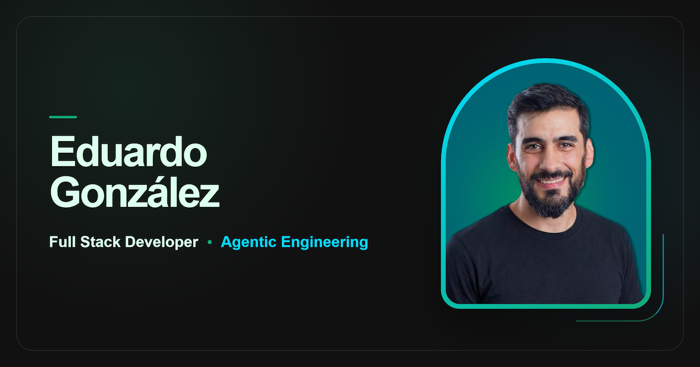

  
  <h1>Eduardo González</h1>
  
<strong>Full Stack Developer · Agentic Engineering</strong>

  
Uruguay

  
<em>Entiendo el proceso. Diseño el sistema. Verifico el resultado.</em>

  

    <a href="https://edugonzalez.dev">Portfolio</a> ·
    <a href="https://www.linkedin.com/in/edugonzalezdev/">LinkedIn</a> ·
    <a href="mailto:edugonzalezdev@gmail.com">Email</a>
  

Durante más de 10 años trabajé comprendiendo procesos logísticos y operativos. Hoy convierto esa complejidad en software mantenible: investigo el problema, especifico la solución y uso flujos de IA aplicada bajo dirección humana para implementar, verificar y documentar cada resultado.

## Qué construyo

- Sistemas internos y herramientas para procesos operativos.
- Paneles que convierten datos en visibilidad para decidir.
- Integraciones y automatizaciones que reducen trabajo manual.
- Aplicaciones full stack mantenibles, con límites y validaciones explícitos.

## Cómo trabajo

**Diagnóstico → Especificación → Implementación → Verificación**

Uso IA como herramienta dentro de un proceso controlado: la dirección, los criterios y la decisión final siguen siendo humanos. El objetivo no es producir más código, sino reducir incertidumbre y entregar evidencia verificable.

## Experiencia y formación

- Más de 10 años de experiencia en operaciones y logística.
- **Certified Tech Developer** — completado en 2025.
- **IA Engineering**, UTEC + 4Geeks — en curso.
- **IA para Programadores**, Digital House — completado.

## Fuera del código

Disfruto elaborar cerveza artesanal. **Bisbier** conecta ese interés con el diseño de producto y el desarrollo de software.

## Contacto

[Portfolio](https://edugonzalez.dev) · [LinkedIn](https://www.linkedin.com/in/edugonzalezdev/) · [edugonzalezdev@gmail.com](mailto:edugonzalezdev@gmail.com)
